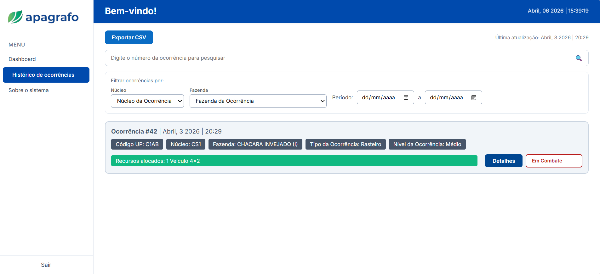
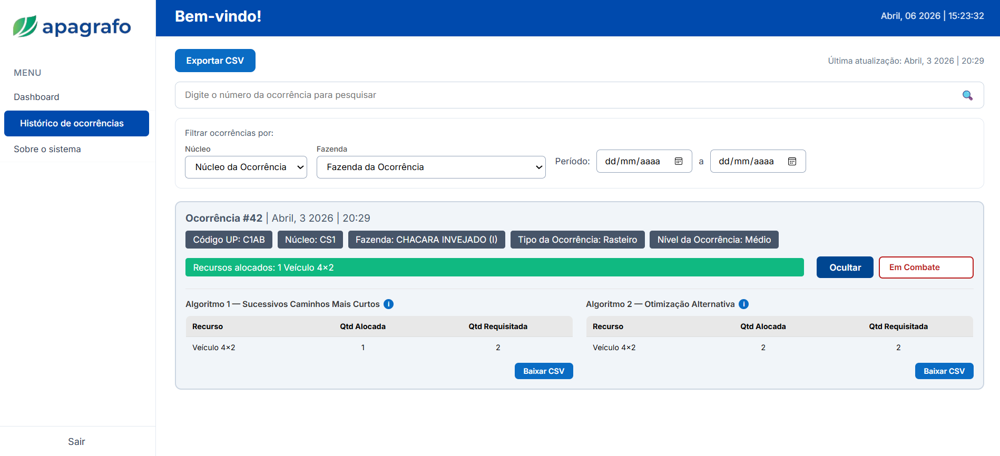
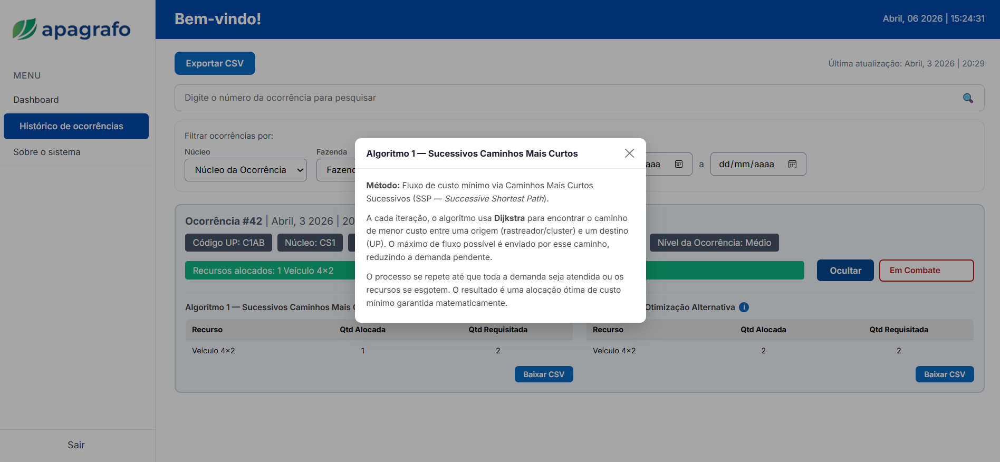
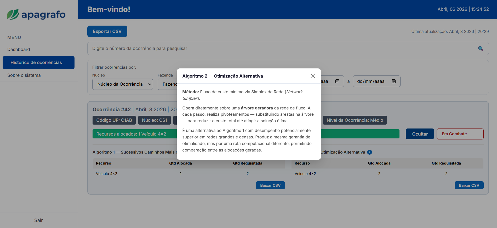

# Teste de Usabilidade — Pop-up de Informações dos Algoritmos

## Contexto do Projeto

O **Apagrafo** é um sistema de apoio à decisão desenvolvido para a Suzano, voltado à gestão de respostas a incêndios florestais. O sistema utiliza dois algoritmos de otimização baseados em grafos para recomendar a alocação de recursos (aeronaves, veículos, brigadistas) às Unidades Produtivas (UPs) com ocorrências ativas:

- **Algoritmo 1 — Sucessivos Caminhos Mais Curtos (SSP):** utiliza Dijkstra iterativamente para encontrar o caminho de menor custo entre rastreadores e UPs até esgotar a demanda.
- **Algoritmo 2 — Otimização Alternativa (Network Simplex):** opera sobre uma árvore geradora da rede de fluxo, realizando pivoteamentos para minimizar o custo total.

Ambos os algoritmos produzem resultados exibidos na tela de **Histórico de Ocorrências**, onde o gestor pode consultar qual algoritmo gerou cada alocação. Um botão de informação **"i"** ao lado de cada algoritmo abre um pop-up explicativo com a descrição do método utilizado.

---

## 1. Tela(s) Analisada(s)

### Prints das telas / fluxo do projeto

Figura 1 — Tela Inicial de login (Dashboard do Gestor) 
 
Fonte: Elaborado pelos autores (2026)

 

Figura 2 — Tela de Histórico com Ocorrência com aba "Detalhes" Fechada 
 
Fonte: Elaborado pelos autores (2026)

 

Figura 3 — Tela de Histórico com Ocorrência com aba "Detalhes" Aberta 
 
Fonte: Elaborado pelos autores (2026)

 

Figura 4 — Pop-up do Algoritmo 1 (Sucessivos Caminhos Mais Curtos) 
 
Fonte: Elaborado pelos autores (2026)

 

Figura 5 — Pop-up do Algoritmo 2 (Otimização Alternativa) 
 
Fonte: Elaborado pelos autores (2026)

**Descrição do contexto:** Na tela de Histórico de Ocorrências, cada card de ocorrência exibe qual algoritmo gerou a alocação de recursos. Ao clicar no botão "i" ao lado do nome do algoritmo, um pop-up modal é aberto com uma descrição técnica do método utilizado.

---

## 2. Tipo de Teste

**Tipo:** Teste de Visualização

**O que será testado:** A clareza e a acessibilidade das informações apresentadas no pop-up de descrição dos algoritmos — verificando se o usuário consegue localizar, abrir e compreender o conteúdo exibido a partir da tela de histórico de ocorrências.

---

## 3. Conjunto de Perguntas

As perguntas seguem a **técnica do funil** (Nielsen Norman Group), partindo do mais aberto e geral para o mais específico e direcionado, evitando indução antes de coletar a percepção espontânea do usuário.

**1. (Aberta — ampla)** Ao olhar para essa tela, o que chama mais a sua atenção? O que você consegue identificar sobre como os recursos foram alocados nessa ocorrência?

**2. (Aberta — exploração)** Você percebeu alguma informação sobre o método ou critério utilizado pelo sistema para fazer essa alocação? Como você chegou a essa informação?

**3. (Aberta — escopo reduzido)** Se você quisesse entender melhor por que o sistema escolheu determinados recursos para essa ocorrência, o que você faria nessa tela?

**4. (Semidirigida)** Você viu o botão "i" ao lado do nome do algoritmo? O que você esperaria encontrar ao clicar nele?

**5. (Fechada — confirmação)** Após ler o conteúdo do pop-up, você consegue explicar com suas próprias palavras a diferença entre os dois algoritmos disponíveis no sistema?

---

## 4. Objetivo do Teste

Descobrir se os usuários (Gestores) conseguem, de forma espontânea, localizar e compreender as informações sobre os algoritmos de otimização apresentadas no pop-up — especialmente se a distinção entre o Algoritmo 1 (SSP) e o Algoritmo 2 (Network Simplex) é percebida como acessível e clara sem auxílio externo.

---

## 5. Ação ou Entendimento Esperado

O usuário deve ser capaz de localizar o botão "i" na tela de histórico, abrir o pop-up correspondente ao algoritmo utilizado e compreender, em linhas gerais, qual método foi aplicado na alocação de recursos — diferenciando o Algoritmo 1 do Algoritmo 2 com base na descrição apresentada.
